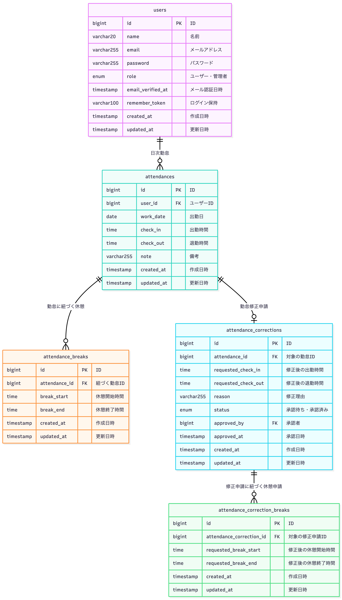

# 勤怠管理アプリ(Attendance-App)

ユーザーの勤怠と管理を行う勤怠管理アプリ

## 主な機能
> - **ユーザー**会員登録・ログイン・ログアウト
> - 勤怠の打刻（出勤・休憩・退勤）
> - 勤務情報取得
> - 勤怠の修正申請
> - 申請のステータス確認（承認待ち・承認済み）
> - **管理者**　ログイン・ログアウト
> - 日時勤怠一覧の確認
> - 各勤怠の詳細を確認・修正
> - スタッフ一覧とスタッフ毎の月次勤怠一覧の確認


## 環境構築

1. リポジトリをクローン
```bash
git clone git@github.com:YuHirasaka/Attendance-app.git
```
2. Dockerを起動する
3. プロジェクト直下で、以下のコマンドを実行する
```bash
make init
```
---

## 使用技術

- docker
- php　8.1.34
- nginx 1.21.1
- mysql 8.0.26
- laravel 8.83.29
- mailtrap

---

## URL

- 開発環境：http://localhost/
- phpMyAdmin：http://localhost:8080/
- Mailtrap（メール確認用サンドボックス）：https://mailtrap.io/inboxes

## テーブル仕様
### usersテーブル
| カラム名 | 型 | primary key | unique key | not null | foreign key |
| --- | --- | --- | --- | --- | --- |
| id | bigint | ◯ |  | ◯ |  |
| name | varchar(20) |  |  | ◯ |  |
| email | varchar(255) |  | ◯ | ◯ |  |
| password | varchar(255) |  |  | ◯ |  |
| role | enum(user.admin) |  |  | ◯ |  |
| email_verified_at | timestamp |  |  |  |  |
| remember_token | varchar(100) |  |  |  |  |
| created_at | timestamp |  |  |  |  |
| updated_at | timestamp |  |  |  |  |


### attendancesテーブル
| カラム名 | 型 | primary key | unique key | not null | foreign key |
| --- | --- | --- | --- | --- | --- |
| id | bigint | ◯ |  | ◯ |  |
| user_id | bigint |  |  | ◯ | users(id) |
| work_date | date |  |  | ◯ |  |
| check_in | time |  |  | ◯ |  |
| check_out | time |  |  |  |  |
| note | varchar(255) |  |  |  |  |
| created_at | timestamp |  |  |  |  |
| updated_at | timestamp |  |  |  |  |

### attendance_breaksテーブル
| カラム名 | 型 | primary key | unique key | not null | foreign key |
| --- | --- | --- | --- | --- | --- |
| id | bigint | ◯ |  | ◯ |  |
| attendance_id | bigint |  |  | ◯ | attendances(id) |
| break_start | time |  |  | ◯ |  |
| break_end | time |  |  |  |  |
| created_at | timestamp |  |  |  |  |
| updated_at | timestamp |  |  |  |  |

### attendance_correctionsテーブル
| カラム名 | 型 | primary key | unique key | not null | foreign key |
| --- | --- | --- | --- | --- | --- |
| id | bigint | ◯ |  | ◯ |  |
| attendance_id | bigint |  | ◯ | ◯ | attendances(id) |
| requested_check_in | time |  |  | ◯ |  |
| requested_check_out | time |  |  | ◯ |  |
| reason | varchar(255) |  |  | ◯ |  |
| status | enum(pending.approved) |  |  | ◯ |  |
| approved_by | bigint |  |  |  | users(id) |
| approved_at | timestamp |  |  |  |  |
| created_at | timestamp |  |  |  |  |
| updated_at | timestamp |  |  |  |  |

## attendance_correction_breaksテーブル
| カラム名 | 型 | primary key | unique key | not null | foreign key |
| --- | --- | --- | --- | --- | --- |
| id | bigint | ◯ |  | ◯ |  |
| attendance_correction_id | bigint |  |  | ◯ | attendance_corrections(id) |
| requested_break_start | time |  |  | ◯ |  |
| requested_break_end | time |  |  | ◯  |  |
| created_at | timestamp |  |  |  |  |
| updated_at | timestamp |  |  |  |  |

## ER図


## テストアカウント

## php unitテスト