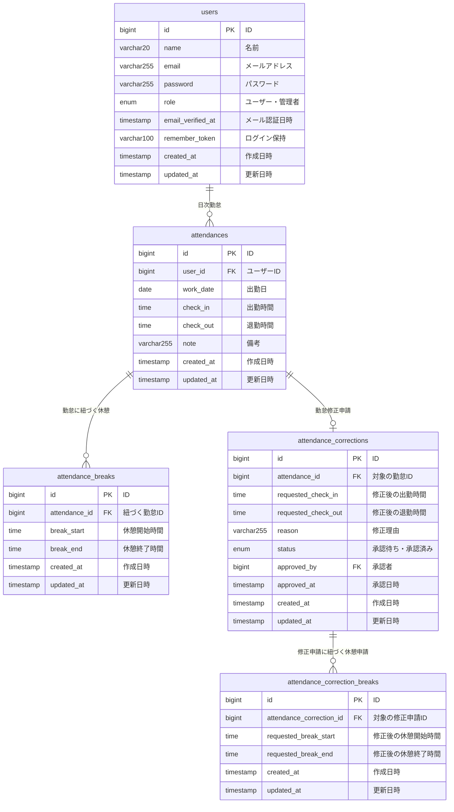

```mermaid

erDiagram
    users ||--o{ attendances : "日次勤怠"
    attendances ||--o{ attendance_breaks : "勤怠に紐づく休憩"
    attendances ||--o| attendance_corrections : "勤怠修正申請"
    attendance_corrections ||--o{ attendance_correction_breaks : "修正申請に紐づく休憩申請"

    users {
        bigint id PK "ID"
        varchar20 name "名前"
        varchar255 email "メールアドレス"
        varchar255 password "パスワード"
        enum role "ユーザー・管理者"
        timestamp email_verified_at "メール認証日時"
        varchar100 remember_token "ログイン保持"
        timestamp created_at "作成日時"
        timestamp updated_at "更新日時"
    }

    attendances {
        bigint id PK "ID"
        bigint user_id FK "ユーザーID"
        date work_date "出勤日"
        time check_in "出勤時間"
        time check_out "退勤時間"
        varchar255 note "備考"
        timestamp created_at "作成日時"
        timestamp updated_at "更新日時"
    }

    attendance_breaks {
        bigint id PK "ID"
        bigint attendance_id FK "紐づく勤怠ID"
        time break_start "休憩開始時間"
        time break_end "休憩終了時間"
        timestamp created_at "作成日時"
        timestamp updated_at "更新日時"
    }

    attendance_corrections {
        bigint id PK "ID"
        bigint attendance_id FK "対象の勤怠ID"
        time requested_check_in "修正後の出勤時間"
        time requested_check_out "修正後の退勤時間"
        varchar255 reason "修正理由"
        enum status "承認待ち・承認済み"
        bigint approved_by FK "承認者"
        timestamp approved_at "承認日時"
        timestamp created_at "作成日時"
        timestamp updated_at "更新日時"
    }

    attendance_correction_breaks {
        bigint id PK "ID"
        bigint attendance_correction_id FK "対象の修正申請ID"
        time requested_break_start "修正後の休憩開始時間"
        time requested_break_end "修正後の休憩終了時間"
        timestamp created_at "作成日時"
        timestamp updated_at "更新日時"
    }

```